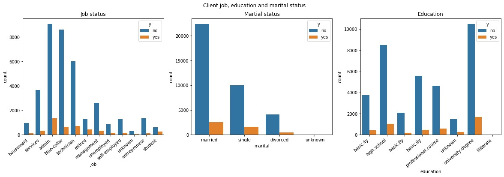

# Banking - Project - Deposits
---
## Project Description
Analyzing the data related to direct marketing campaigns (phone calls) of a Portuguese bank using various ML techniques. The classification goal is to predict if the client will subscribe a long-term deposit. 
## Data
The data includes personal information about each customer, as well as information about the bank’s previous efforts in marketing to that client,

## EDA
**Job status**
There are twelve types of jobs that occur in this data set. "Admin.","blue-collar"and "technician" are the most frequent.
**Marital status**
The most frequent potential clients who are contacted are those with martial status "married", followed by "single" and "divorced".
**Education level**
There are eight levels "basic.4y","basic.6y","basic.9y","high.school","illiterate","professional.course","university.degree","unknown"

