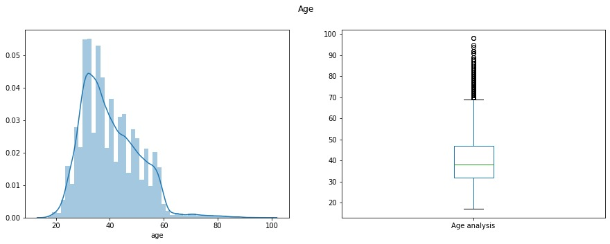
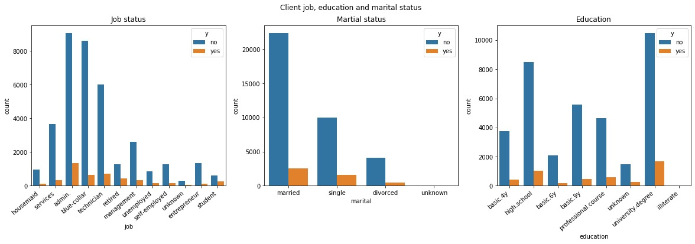
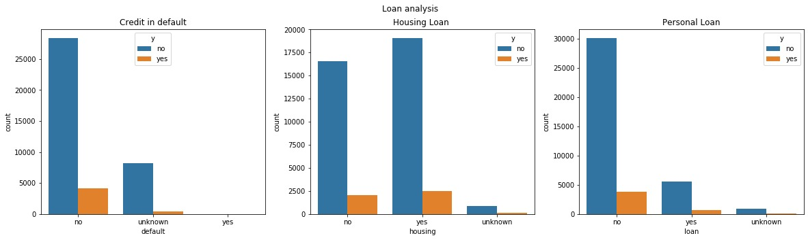
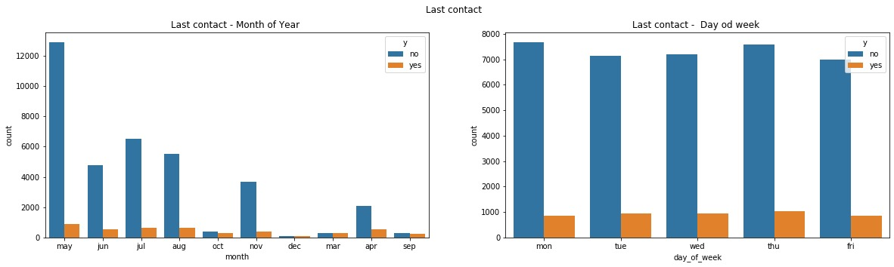
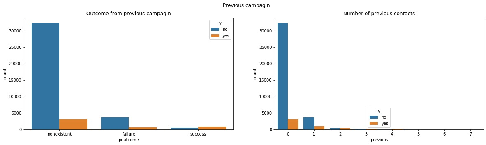

# Banking - Project - Deposits
---
## Project Description
Analyzing the data related to direct marketing campaigns (phone calls) of a Portuguese bank using various ML techniques. The classification goal is to predict if the client will subscribe a long-term deposit. 
## Data
The data includes personal information about each customer as well as information about the bank’s previous efforts in marketing to that client and social and economic context attributes.

## EDA
### Univariate Analysis
**Age**

75% of the clients in the data set are 31 years-old or older.

---

**Job status**

There are twelve types of jobs that occur in this data set. "Admin.","blue-collar"and "technician" are the most frequent.

**Education level**

There are eight education levels that occur in the data set. "University.degree", "high.school" and "basic.9y" are the most fequent.

---

**Marital status**

The most frequent potential clients who are contacted are those with martial status "married", followed by "single" and "divorced".

---

**Loan Exposure**

Most of the potential clients don't have personal loan or loan in default. The frequency of clients who have and don't have housing loan is very similar. 

---

**Contacts**

The Bank contact the clients mostly between May and August, during the whole working week and preferred type of call is on mobile phone.

---

**Previous camagin**

Most of the potential clients who are contacted for the current campaign were not previously contacted for other campaign.

---

### Bivariate Analysis
Explaining relationship between variables and the target variable.

**Client job, education and marital statuse**
 
Most of the clients that subscribed to long-term deposit are clients employed in Administration, Technicians and Blue-Collar.
In addition, married people and people with higher education (university degree) are more willing to subscribe to long-term deposit.

---

**Loan Exposure**
 
Clients without personal loan and loan in default are also more willing to subscribe to long-term deposit. 
Clients with housing loan are not significantly prone to long-term subscription compare to clients without housing loan.

---

**Contacts**
 
Clients are more willing to subscribe to long-term deposit between May and August. The Bank can call clients any working day since there is no preferred day of the week by the clients.

---

**Contacts**
 
Most of the clients that subscribed to long-term deposit were not contacted before for previous campaigns following by those who were contacted for previous campaign and the result was successful.

---

 

## Evaluation Report

**Accuracy, Precison, Recall**

  The following classification methods were tried and tested:
  - [ ] DecisionTree
  - [ ] RandomForest
  - [ ] KNN
  - [ ] Gaussian
  - [ ] GradientBoosting
  - [X] EXtremeGradientBoosting
  
  Our best model, XGBoost has:
  - **Recall** of **0.88** which means that it correctly identifies 88% of all deposit subscriptions.
  - **Precision** of **0.95** which means that when it predicts deposit subscriptions, it is correct 95% of the time.
  

|Metric| DecisionTree| RandomForest|	KNN|	Gaussian|	GradientBoosting|	EXtremeGradientBoosting|
|------|-------------|--------------|----|-----------|----------------|-------------------------|
|Accuracy|	0.838454|	0.890829|	0.724633|	0.714286|	0.839867|	0.922144|
|Recall|	0.779378|	0.827970|	0.624123|	0.525299|	0.781475|	0.883763|
|Precision|	0.883800|	0.947028|	0.781150|	0.844497|	0.884806|	0.957243|

 

**Confusion Matrix**

**ROC Curve**

# Dataset info
The data is related with direct marketing campaigns of a banking institution. The marketing campaigns were based on phone calls (on client's cells or telephones). Often, more than one contact to the same client was required, 
in order to access if the product (bank term deposit) would be ('yes') or not ('no') subscribed. 

The dataset has 41188 rows (entries) and 20 inputs (features) and a binary output variable ("yes", "no"). 

Features:
- bank client data:
1. age (numeric)
2. job : type of job (categorical: "admin.","blue-collar","entrepreneur","housemaid","management","retired","self-employed","services","student","technician","unemployed","unknown")
3. marital : marital status (categorical: "divorced","married","single","unknown"; note: "divorced" means divorced or widowed)
4. education (categorical: "basic.4y","basic.6y","basic.9y","high.school","illiterate","professional.course","university.degree","unknown")
5. default: has credit in default? (categorical: "no","yes","unknown")
6. housing: has housing loan? (categorical: "no","yes","unknown")
7. loan: has personal loan? (categorical: "no","yes","unknown")
- related with the last contact of the current campaign:
8. contact: contact communication type (categorical: "cellular","telephone") 
9. month: last contact month of year (categorical: "jan", "feb", "mar", ..., "nov", "dec")
10. day_of_week: last contact day of the week (categorical: "mon","tue","wed","thu","fri")
11. duration: last contact duration, in seconds (numeric). Important note:  this attribute highly affects the output target (e.g., if duration=0 then y="no"). Yet, the duration is not known before a call is performed.
Also, after the end of the call y is obviously known. Thus, this input should only be included for benchmark purposes and should be discarded if the intention is to have a realistic predictive model.
- other attributes:
12. campaign: number of contacts performed during this campaign and for this client (numeric, includes last contact)
13. pdays: number of days that passed by after the client was last contacted from a previous campaign (numeric; 999 means client was not previously contacted)
14. previous: number of contacts performed before this campaign and for this client (numeric)
15. poutcome: outcome of the previous marketing campaign (categorical: "failure","nonexistent","success")
- social and economic context attributes
16. emp.var.rate: employment variation rate - quarterly indicator (numeric)
17. cons.price.idx: consumer price index - monthly indicator (numeric)     
18. cons.conf.idx: consumer confidence index - monthly indicator (numeric)     
19. euribor3m: euribor 3 month rate - daily indicator (numeric)
20. nr.employed: number of employees - quarterly indicator (numeric)

Output variable (desired target):
21. y - has the client subscribed a term deposit? (binary: "yes","no")

Missing Attribute Values: There are several missing values in some categorical attributes, all coded with the "unknown" label. These missing values can be treated as a possible class label or using deletion or imputation techniques.

The dataset is very unbalanced since it contains 36,548 "no" outputs and only 4,640 "yes" outputs. 

## Short description of all files
**Notebook for training**
We've first done analysis here to check how many and which columns are numeric, which are categorical. Then we have checked if there are some missing values which wasn't the case. We proceeded with handling the missing data which we
addressed by replacing the unknown values with most frequent values of the respective column. We then dropped the duration feature in line with the abovementioned important note related to that feature. 

We've then applied robust scaler to the age,cons.price.idx,cons.conf.idx,euribor3m and campaign features whereas we utilized normalizer for the previous and pdays features. 

As a next step, we proceeded with the encoding where we utilized label encoder for the output (class) column and for all the rest categorical features, we utilized catboost encoder. 

We then applied SMOTE technique in order to balance the dataset which as noted above is very unbalanced. We've first split the X and y to train and test sets so we can apply SMOTE separately to the train and test sets so we avoid 
both underestimation and overestimation.

We've then implemented six classification models:
- DecisionTreeClassifier
- RandomForestClassifier
- KNeighborsClassifier
- GaussianNB
- GradientBoostingClassifier
- XGBClassifier

XGBClassifier gave us best accuracy, precision and recall results. We checked this with comparing the accuracy, precision and recall results of all clasification models in the next step. We've also drawn the confusion matrices of all 6
models so we can graphically present the true positives and negatives as well as false positives and negatives of each classification model. 

We've also drawn An ROC curves (receiver operating characteristic curves) of all models which have shown the performance of the classification models at all classification thresholds.

The next step involved implementing hyperparametar optimization for the XGBClassifier as best classification model where we utilized RandomizedSearchCV which assisted us to slightly improve the results of the model. 

As penultimate step, we've done 10 fold cross validation so we assess the performance of our two best models more rigorously. It has demonstrated lower accuracy, precision and recall results compared with the train_test_split. 

And finally, we've implemented a step which assessed the importance of each of the features in determning the output so we have clearer picture about what features are most correlated and influence the output variable.   

**Notebook for EDA**
We've done univariate and bivariate analysis which are included in the notebook for EDA. First univariate analysis we did was for the 'y' column, i.e the output variable which indicated that the dataset is very unbalances as abovementioned.
We also did univariate analysis of all features (inputs) included in the database and we presented them with plots utilizing matplotlib and seaborn libraries. We've also done a log transformation to eliminate the 'skew' effect of the
campaign feature before presenting it. 

We also did several bivariate analyses. We've done bivariate anaslysis of the following features vis a vis the output (class):
1. job
2. marital
3. education
4. default
5. housing
6. loan
7. month
8. day_of_week
9. poutcome
10. previous 

All of abovementioned bivariate analyses were done in single chart each. 

We've also done bivariate analyses of the following features, however they were presented in two separate charts each - one for the feature vis a vis "yes" class and another for the for the feature vis a vis "no" class:
1. campaign 
2. euribor3m
3. cons.conf.idx
4. cons.price.idx

And last but not least, we did analysis where we compared the emp.var.rate and nr.employed features which has demonstrated that they're almost fully corellated. 

