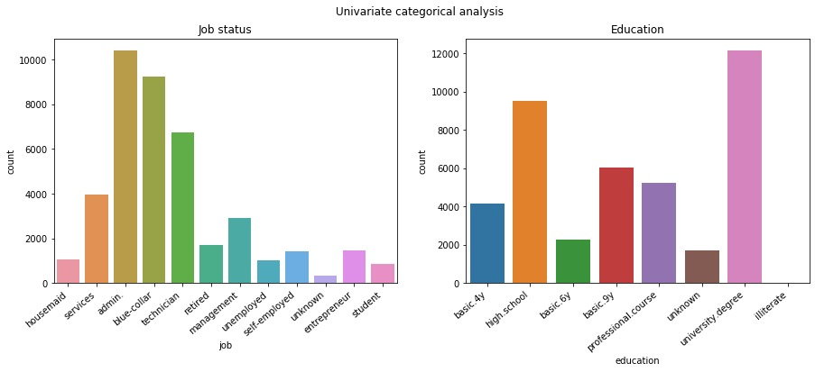
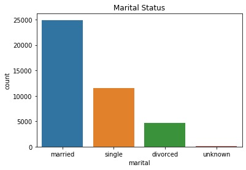
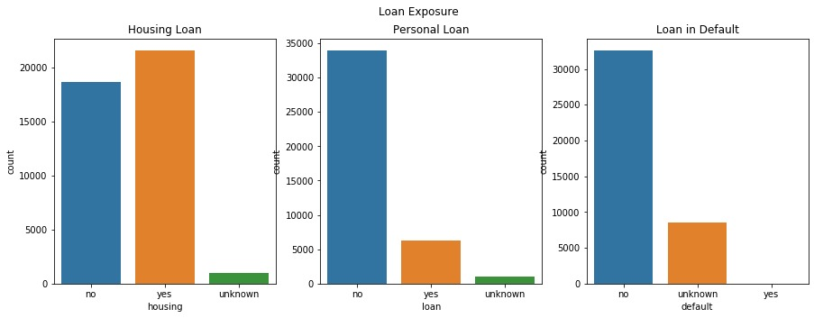
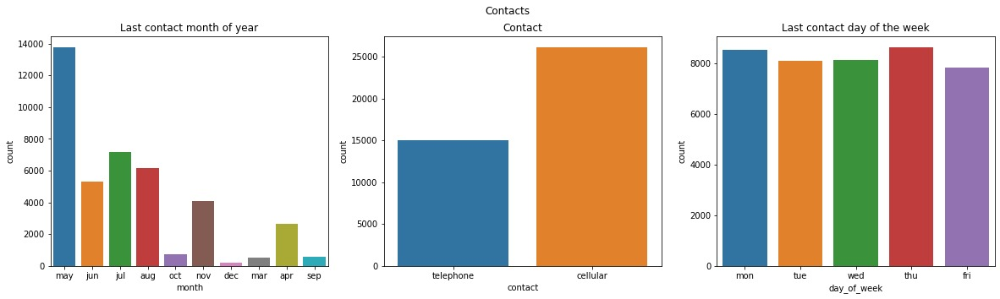
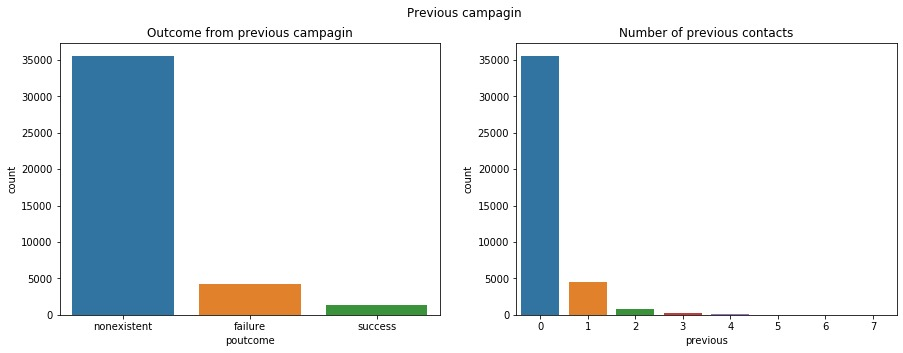
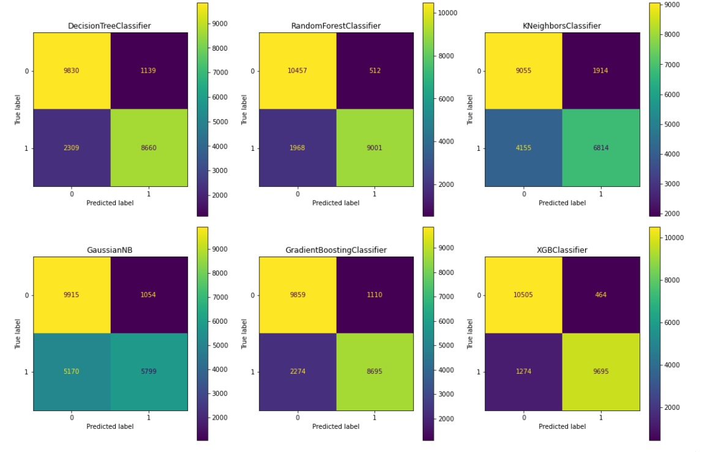
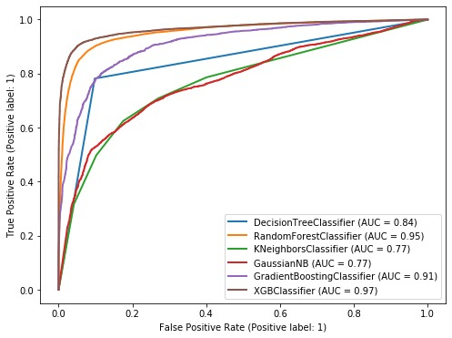

# Banking - Project - Deposits
---
## Project Description
Analyzing the data related to direct marketing campaigns (phone calls) of a Portuguese bank using various ML techniques. The classification goal is to predict if the client will subscribe a long-term deposit. 
## Data
The data includes personal information about each customer as well as information about the bank’s previous efforts in marketing to that client and social and economic context attributes.

## EDA
**Job status**

There are twelve types of jobs that occur in this data set. "Admin.","blue-collar"and "technician" are the most frequent.

**Education level**

There are eight education levels that occur in the data set. "University.degree", "high.school" and "basic.9y" are the most fequent.

---

**Marital status**

The most frequent potential clients who are contacted are those with martial status "married", followed by "single" and "divorced".

---

**Loan Exposure**

Most of the potential clients don't have personal loan or loan in default. The frequency of clients who have and don't have housing loan is very similar. 

---

**Contacts**

Client contacts are more frequent during May, July and August and preferred contact type is by cellular. Client contacts during different days of the week are equally distributed.

---

**Previous camagin**

Most of the potential clients who are contacted for the current campaign were not previously contacted for other campaign.

---

## Evaluation Report

**Accuracy, Precison, Recall**

|Metric| DecisionTree| RandomForest|	KNN|	Gaussian|	GradientBoosting|	EXtremeGradientBoosting|
|------|-------------|--------------|----|-----------|----------------|-------------------------|
|Accuracy|	0.838454|	0.890829|	0.724633|	0.714286|	0.839867|	0.922144|
|Recall|	0.779378|	0.827970|	0.624123|	0.525299|	0.781475|	0.883763|
|Precision|	0.883800|	0.947028|	0.781150|	0.844497|	0.884806|	0.957243|

**Confusion Matrix**

**ROC Curve**

# Dataset info
The data is related with direct marketing campaigns of a banking institution. The marketing campaigns were based on phone calls (on client's cells or telephones). Often, more than one contact to the same client was required, 
in order to access if the product (bank term deposit) would be ('yes') or not ('no') subscribed. 

The dataset has 41188 rows (entries) and 20 inputs (features) and a binary output variable ("yes", "no"). 

Features (bank client data):
   
   1 - age (numeric)
   
   2 - job : type of job (categorical: "admin.","blue-collar","entrepreneur","housemaid","management","retired","self employed","services","student","technician","unemployed","unknown")
   
   3 - marital : marital status (categorical: "divorced","married","single","unknown"; note: "divorced" means divorced or widowed)
   
   4 - education (categorical: "basic.4y","basic.6y","basic.9y","high.school","illiterate","professional.course","university.degree","unknown")
   
   5 - default: has credit in default? (categorical: "no","yes","unknown")
   
   6 - housing: has housing loan? (categorical: "no","yes","unknown")
   
   7 - loan: has personal loan? (categorical: "no","yes","unknown")
   
   related with the last contact of the current campaign:
   
   8 - contact: contact communication type (categorical: "cellular","telephone") 
   
   9 - month: last contact month of year (categorical: "jan", "feb", "mar", ..., "nov", "dec")
   
  10 - day_of_week: last contact day of the week (categorical: "mon","tue","wed","thu","fri")
  
  11 - duration: last contact duration, in seconds (numeric). Important note:  this attribute highly affects the output target (e.g., if duration=0 then y="no"). Yet, the duration is not known before a call is performed. Also, after the end of the call y is obviously known. Thus, this input should only be included for benchmark purposes and should be discarded if the intention is to have a realistic predictive model.
  
  other attributes:
  
  12 - campaign: number of contacts performed during this campaign and for this client (numeric, includes last contact)
  
  13 - pdays: number of days that passed by after the client was last contacted from a previous campaign (numeric; 999 means client was not previously contacted)
  
  14 - previous: number of contacts performed before this campaign and for this client (numeric)
  
  15 - poutcome: outcome of the previous marketing campaign (categorical: "failure","nonexistent","success")
  
  social and economic context attributes
  
  16 - emp.var.rate: employment variation rate - quarterly indicator (numeric)
  
  17 - cons.price.idx: consumer price index - monthly indicator (numeric)     
  
  18 - cons.conf.idx: consumer confidence index - monthly indicator (numeric)  
  
  19 - euribor3m: euribor 3 month rate - daily indicator (numeric)
  
  20 - nr.employed: number of employees - quarterly indicator (numeric)
  

  Output variable (desired target):
  
  21 - y - has the client subscribed a term deposit? (binary: "yes","no")

Missing Attribute Values: There are several missing values in some categorical attributes, all coded with the "unknown" label. These missing values can be treated as a possible class label or using deletion or imputation techniques.

The dataset is very unbalanced since it contains 36,548 "no" outputs and only 4,640 "yes" outputs
