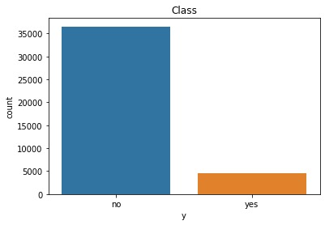

# Banking - Project -Term Deposits
---
## Project Description
Analyzing the data related to direct marketing campaigns (phone calls) of a Portuguese bank using various ML techniques. The classification goal is to predict if the client will subscribe a Term deposit. 

## Dataset info
The data includes personal information about each customer as well as information about the bank’s previous efforts in marketing to that client and social and economic context attributes. The data is related with direct marketing campaigns of a banking institution. The marketing campaigns were based on phone calls (on client's cells or telephones). Often, more than one contact to the same client was required, in order to access if the product (bank term deposit) would be ('yes') or not ('no') subscribed. 

The dataset has 41188 rows (entries) and 20 inputs (features) and a binary output variable ("yes", "no"). 

**Features**:

- bank client data:

 1. age (numeric)
 2. job : type of job (categorical: "admin.","blue-collar","entrepreneur","housemaid","management","retired","self-  employed","services","student","technician","unemployed","unknown")
 3. marital : marital status (categorical: "divorced","married","single","unknown"; note: "divorced" means divorced or widowed)
 4. education (categorical: "basic.4y","basic.6y","basic.9y","high.school","illiterate","professional.course","university.degree","unknown")
 5. default: has credit in default? (categorical: "no","yes","unknown")
 6. housing: has housing loan? (categorical: "no","yes","unknown")
 7. loan: has personal loan? (categorical: "no","yes","unknown")
  
- related with the last contact of the current campaign:
 8. contact: contact communication type (categorical: "cellular","telephone") 
 9. month: last contact month of year (categorical: "jan", "feb", "mar", ..., "nov", "dec")
 10. day_of_week: last contact day of the week (categorical: "mon","tue","wed","thu","fri")
 11. duration: last contact duration, in seconds (numeric). 

- other attributes:

 12. campaign: number of contacts performed during this campaign and for this client (numeric, includes last contact)
 13. pdays: number of days that passed by after the client was last contacted from a previous campaign (numeric; 999 means client was not previously contacted)
 14. previous: number of contacts performed before this campaign and for this client (numeric)
 15. poutcome: outcome of the previous marketing campaign (categorical: "failure","nonexistent","success")
- social and economic context attributes

 16. emp.var.rate: employment variation rate - quarterly indicator (numeric)
 17. cons.price.idx: consumer price index - monthly indicator (numeric)     
 18. cons.conf.idx: consumer confidence index - monthly indicator (numeric)     
 19. euribor3m: euribor 3 month rate - daily indicator (numeric)
 20. nr.employed: number of employees - quarterly indicator (numeric)

Output variable (desired target):
 21. y - has the client subscribed a term deposit? (binary: "yes","no")

Missing Attribute Values: There are several missing values in some categorical attributes, all coded with the "unknown" label. These missing values can be treated as a possible class label or using deletion or imputation techniques.

## Short description of all files
**Notebook for training**

***Data preprocessing***

First analysis was done in order to determine how many and which columns are numeric, which are categorical. 

- Feature selection -The 'duration' feature is being dropped mainly because this attribute highly affects the output target (e.g., if duration=0 then y="no"). Yet, the duration is not known before a call is performed. Also, after the end of the call y is obviously known.

- Missing data -This data set does not have missing values. but still some of the features have unknown values. For some features it is decided for unknown to remain as it is and some of them like loan and default will be repalsed with most frequent values due to the fact that this information is usually publicly available.

- Scaling - We've then applied robust scaler to the age,cons.price.idx,cons.conf.idx,euribor3m and campaign features whereas we utilized normalizer for the previous and pdays features. 

- Category encoding - As a next step, we proceeded with the encoding where we utilized label encoder for the output (class) column and for all the rest categorical features, we utilized catboost encoder. 

- SMOTE - We then applied SMOTE technique in order to balance the dataset which as very unbalanced. We've first split the X and y to train and test sets so we can apply SMOTE separately to the train and test sets so we avoid 
both underestimation and overestimation.

***Classification models***

 Six classification models were implmented:
1.DecisionTreeClassifier
2.RandomForestClassifier
3.KNeighborsClassifier
4.GaussianNB
5.GradientBoostingClassifier
6.XGBClassifier

- Best Model - XGBClassifier gave us best accuracy, precision and recall results. We checked this with comparing the accuracy, precision and recall results of all clasification models in the next step. 

- Evaluation Metrics - We've drawn the confusion matrices of all 6
models so we can graphically present the true positives and negatives as well as false positives and negatives of each classification model. We've also drawn An ROC curves (receiver operating characteristic curves) of all models which have shown the performance of the classification models at all classification thresholds. More details for different metrics below in Evaluation Report

- Hyperparametar optimization - The next step involved implementing hyperparametar optimization for the XGBClassifier as best classification model where we utilized RandomizedSearchCV which assisted us to slightly improve the results of the model. 

- Validation - As penultimate step, we've done 10 fold cross validation so we assess the performance of our two best models more rigorously. It has demonstrated lower accuracy, precision and recall results compared with the train_test_split. 

- Feature importance - And finally, we've implemented a step which assessed the importance of each of the features in determning the output so we have clearer picture about what features are most correlated and influence the output variable.   

**Notebook for EDA**

We've done univariate and bivariate analysis which are included in the notebook for EDA. First univariate analysis we did was for the 'y' column, i.e the output variable which indicated that the dataset is very unbalances as abovementioned.
We also did univariate analysis of all features (inputs) included in the database and we presented them with plots utilizing matplotlib and seaborn libraries. We've also done a log transformation to eliminate the 'skew' effect of the
campaign feature before presenting it. 

We also did several bivariate analyses. We've done bivariate anaslysis of the following features vis a vis the output (class):
1. job
2. marital
3. education
4. default
5. housing
6. loan
7. month
8. day_of_week
9. poutcome
10. previous 

All of abovementioned bivariate analyses were done in single chart each. 

We've also done bivariate analyses of the following features, however they were presented in two separate charts each - one for the feature vis a vis "yes" class and another for the for the feature vis a vis "no" class:
1. campaign 
2. euribor3m
3. cons.conf.idx
4. cons.price.idx

And last but not least, we did analysis where we compared the emp.var.rate and nr.employed features which has demonstrated that they're almost fully corellated. 

**Notebook for prediction**

We've created dataset with only one entry to test our model based on XGBClassifier. We've divided the dataset columns on X_test and y_test items. W've then implemented RobustScaler on the age, cons.price.idx, cons.conf.idx,
euribor3m, campaign features in the X_test and we've also applied Normalizer on the previous and pdays features in the same dataset implementing the same logic that was applied for the preprocessing of the original model.
We utilized the same encoders as the ones we've used in the original model and we've loaded the model with applying the pickle.load command.
We predicted the value of the X_test entry of the loaded model and the result of the prediction was identical with the X_test entry, demonstrating the robustness of our model.

## Exploratory Data Analysis
### Univariate Analysis

**Output variable**

The dataset is very unbalanced since it contains 36,548 "no" outputs and only 4,640 "yes" outputs. There is a huge imbalance in target class. Most of the data this data set has are with outcome 'no'which means the client decides not to use this service. This can be interpreted as 11% rate of success in this campagin for client aqusition. 

**Age**

75% of the clients in the data set are 31 years-old or older, which is understandable for those to be targeted, most of the savings are done after 30years old. 

---

**Job status**

There are twelve types of jobs that occur in this data set. Employees from Administration sector, Blue Collar, and Technicians were the most targeted, and this continiues with employees in Services sector and Managenent. This might be due to the fact that Anministration and Blue Collar sectors employee large number of employees, or this is the bank's structure of clients.

**Education level**

There are eight education levels that occur in the data set. Most of the clients had University degree, High school Diploma and Basic 9 year education. This feature is as well connected with Job Status feature. 

---

**Marital status**

The most frequent potential clients who are contacted are those with martial status "married", followed by "single" and "divorced". This is as well understandable due to the fact that most of the savings are done when people are married or single after certain age. 

---

**Loan Exposure**

Most of the potential clients in this dataset don't have personal loan or loan in default. The frequency of clients who have and don't have housing loan is very similar. This feature shows that from loan clients mainly clients that have housing loan are being targeted, it is assumed  that those clients save as well, opposed to clients that have consumer/personal loan or are in default. 

---

**Contacts**

The Bank contact the clients mostly between May and August, during the whole working week and preferred type of call is on mobile phone.

---

**Previous camagin**

Most of the potential clients who are contacted for the current campaign were not previously contacted for other campaign.

---

### Bivariate Analysis
Explaining relationship between variables and the target variable.

**Client job, education and marital status**
 
Most of the clients that subscribed to long-term deposit are clients employed in Administration, Technicians and Blue-Collar.
In addition, married people and people with higher education (university degree) are more willing to subscribe to long-term deposit.

---

**Loan Exposure**
  
When it comes to loan exposure than it can be noticed that most of the clients that subscribed to term deposit are clients that do not have personal loan and their exposure is not in default. When it comes to housing loan than most of the client that subscribed as well have housing loan.

---

**Contacts**
 
Clients are more willing to subscribe to long-term deposit between May and August, this might be due to the fact that most of the targeted campaigns were done in this period. The Bank can call clients any working day since there is no preferred day of the week by the clients for Bank's call.

---

**Contacts**
 
Most of the clients that subscribed to long-term deposit were not contacted before for previous campaigns following by those who were contacted for previous campaign and the result was successful.

---

 

## Evaluation Report

**Accuracy, Precison, Recall**

  The following classification methods were tried and tested:
  - [ ] DecisionTree
  - [ ] RandomForest
  - [ ] KNN
  - [ ] Gaussian
  - [ ] GradientBoosting
  - [X] EXtremeGradientBoosting
  
  Our best model, XGBoost has:
  - **Recall** of **0.88** which means that it correctly identifies 88% of all deposit subscriptions.
  - **Precision** of **0.95** which means that when it predicts deposit subscriptions, it is correct 95% of the time.
  

|Metric| DecisionTree| RandomForest|	KNN|	Gaussian|	GradientBoosting|	EXtremeGradientBoosting|
|------|-------------|--------------|----|-----------|----------------|-------------------------|
|Accuracy|	0.838454|	0.890829|	0.724633|	0.714286|	0.839867|	0.922144|
|Recall|	0.779378|	0.827970|	0.624123|	0.525299|	0.781475|	0.883763|
|Precision|	0.883800|	0.947028|	0.781150|	0.844497|	0.884806|	0.957243|

 

**Confusion Matrix**

**ROC Curve**

 
## Conslusion

**Recommendations to the Marketing Team**

